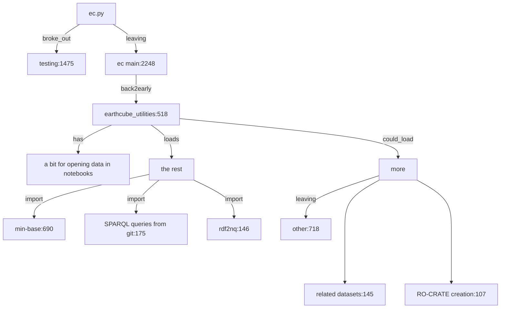

# earthcube_utliites [wiki](https://github.com/earthcube/earthcube_utilities/wiki)

Originally used for notebooks only, but getting more reuse in the rest of the workflow
 this lead to a natural breakdown of submodules, driven by need, in the processing pipeline




This is more how the functionality has been broken down, to help with the ec_utils plan, a more simple [view](https://github.com/earthcube/earthcube_utilities/blob/dcm/earthcube_utilities/docs/sm.md) can be further devloped to 
better show a potiential user about the **Functionality** of the  libraries modules


## _**earthcube_utilities** breakdown_


the file itself can keep some of the notebook specific code or that can go into a notebook/data_download sub modules

_If it can be that is good, but this is about clean coding. So how does importing a single undocumented 
module help a user utilize it._

Functionality:
* mini-base
* query
* rdf to triples
* RO-Crate
* Additional Modules


### Minibase
<ins>__mb.py__ mini-base small util functions</ins> that sometimes end up getting copied into the other places they are needed now
 __some of this could be replaced by libs like: [pydash](https://github.com/dgilland/pydash)__


### Query
<ins>**query.py** </ins> is can do all the SPARQL queries the UI can do.

Query returns a pandas dataframe using the sparqldataframe library. A set of queries based
on the the [facetserch UI sparql queries](https://github.com/earthcube/facetsearch/tree/master/client/src/sparql_blaze)
and other queries utilized for data exploration and data validation are included.

LIST QUERIES: This is the detailed functionality

(I am going to suggest that a list of queries, and functionality, and some details be incorporated into an assets
list. The list should probably be a file in YAML or JSON format in the resources directory.)

|  short_name | file | detailed description |
|-------------| ---- | ------ | 
| summary     | ./resources/sparql/summary.txt | takes query term, `q`, and returns a summary of the matched resoruces |
| sbj2urn     | ./resources/sparql/sbj2urn.txt  | returns the urn of the graph  for a given graph `g`   |

_This is the proposed implementation stratedgy..._ 
it is setup to add one get_{qry_name}\_txt  function to get the txt of the query, usually from raw git 
then a function: {qry_name} that calls one fuction with {qry_name} as the arg, and maybe a variable
it will get the txt from the 1st function, and replace the var w/in the template txt, run the query and return a DF

(**above  reads  like a possible security hole** I am going to run a method with a dynamically defined name.
Implementation seems overly complex, 

Suggest that queries be embedded in resources. which would make things clearer than many courtesy methods.
something simpler, like:

```
def QUERY(endpoint)
# validate that endpoint exists.
def listQueries() 
# return list of queries
def query(self, short_name=summary, options)
# where options would be an object containing passed parameters {"q":"steens"}
def queryFromURL(self, url="https://raw.githubusercontent.com/MBcode/ec/master/NoteBook/sparql-query.txt", options)
```

```python
q = QUERY("http:example.com")
dataframe = q.query("sub2urn",options={"g":"somegraph"} )
dataframe2 = q.queryFromURL( url="https://raw.githubusercontent.com/MBcode/ec/master/NoteBook/sparql-query.txt", options={"q":"steens"})

```

#### Usages:
many. 
* It can be used to get information to validated informaiton from the graph,
* it can be used in notebooks to run queries.

Also, suggest jinja2, or the [standard python3 templates](https://docs.python.org/3.4/library/string.html#template-strings) for replacing parameters in templates.

### RDF to triples
At present, gleaner generates triples, and nabu loads them into the graph as quads.
The summary code needs to know the expected `graph` so this module creates quads from gleaner/milled
Basically, <ins>**rdf2nq.py** takes one form of rdf triples, 
and adds the filename of the file as the last column in its nquads<ins> output
* if it is .ntriples, then you just add a column
* if it is another format like jsonld, then it runs jena's riot RDF I/O technology (RIOT) on it, right now
```shell
rdf2nq.py nabuconfig repository --path (default=milled)
```
The config contains the service secrets, and more importantly the source 'repository' will be in the file.
```python
def s3client(config)
def s3GetFile(s3client, file )
def read_files(s3client, bucket, repo)
def triplesToQuads(triples, graphname)
def appeandToOutput(quads)
def pathToUrn(file) 
   # the path should be summoned/repo/urn.jsonld
   # remove json or jsonld from s3 path
   # returns urn in for urn:repo:file sans extenstion
def __main__
  s3 = s3Client(config)
  files = read_files(s3, config.s3.bucket, repo)
  foreach file in files:
     urn = pathToUrn(file)
     data = s3GetFile(s3client, file.path) # whatever it needs
     quads = triplesToQuads(data, urn)
     appendToOutput(quads)
  outputfile.write() 
```


_Some related could probably be handled by [kglab](https://derwen.ai/docs/kgl/ex4_0/) now_

### RO-CRATE creation
 [RO-Crate issue](https://github.com/earthcube/earthcube_utilities/issues/15) decribes some of the steps needed

The [Notebook Dispatch](https://docs.google.com/document/d/1dIusvhpbJuN7HC8smPPGbn9HIWJGsN7iZafKTRTc42I/edit#heading=h.1izdmil74wk6) describes the possible functionality 

The [Decoder Sprint Document](https://docs.google.com/document/d/1PSPPp3M3OJFUbLPr3zW1Xnt4uQuo-Oruwuh2LqN2yxE/edit#heading=h.muip1py2h08a) includes a diagram of how we might immplement RO-Crate workflows

```python
def s3client() # public bucket
def s3getFile(s3client, path to rocrate)
def s3PathToRoctate(roCrateQueryParameter)
def roCrateRender(rocrate)

```

```python
roCrateQueryParameter = request.params.rocrate
s3 = s3client()
pathToCrate = s3PathToRocrate(roCrateQueryParameter)
rocrate = s3getFile(s3,pathToCrate)
print(roCrateRender(rocrate))
```


## Misc notes:
could be integrated with the new [gleaner-logging](https://github.com/search?q=org%3Agleanerio+logging&type=code).worklfow.

### <ins>Could</ins> be <ins>load</ins>ing:
##### <ins>related-data</ins> using sklearn [here](https://github.com/MBcode/ec/blob/master/qry/rec.py)
##### <ins>RO-CRATE metadata creation</ins>, that dv asked for
