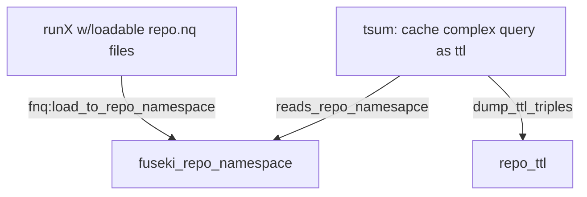
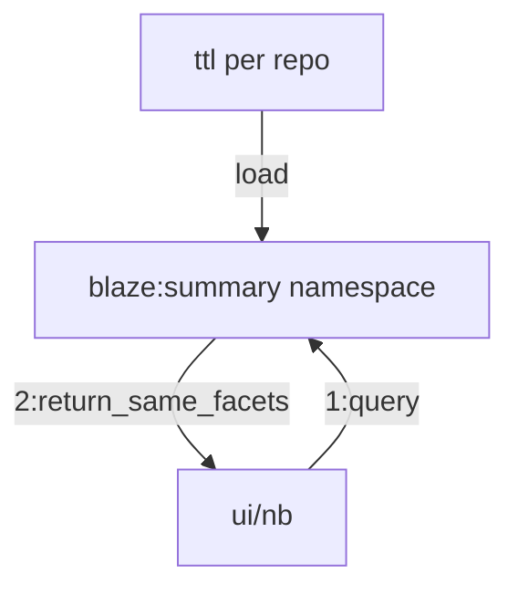
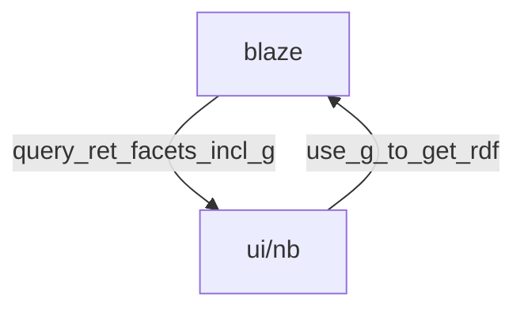

## - 1:make summary triples

### getting crawl quads/repo and sumarizing to endpoint, in [one callgraph *here*](call.md)
#### in the new [decoder staging](https://github.com/MBcode/dc), will reduce dependancy on fuseki, to get [this call graph](https://github.com/MBcode/dc/blob/main/call-summary.md)
#### prereq: [get](https://github.com/MBcode/ec/blob/master/crawl/get.md)/(& [soon](https://github.com/MBcode/ec/blob/master/summary.md) also [have](https://github.com/MBcode/ec/tree/master/crawl)) quads/repo to
### [summarize_repo.sh](https://github.com/MBcode/ec/blob/master/summary/summarize_repo.sh) runs:
#### [fnq.py](https://github.com/MBcode/ec/blob/master/summary/fnq.py) on a repo, to load the quads into repo namespace in fuseki
#### [tsum.py](https://github.com/MBcode/ec/blob/master/summary/tsum.py) for repo, to read that namespace and dump summary ttl triples

  
  
  
## - 2:use for fast sparql on summary namespace

  
## - also: get RDF from endpoint
### which gets rid of need for a duplicate cache

## - ps. metadata from crawl/s, [now easier to use](https://github.com/MBcode/ec/blob/master/system.md)
### [runX](https://github.com/gleanerio/gleaner/issues/126) 'quads' could come from gleaner or extruct crawls, as they are not coupled to outside systems now
