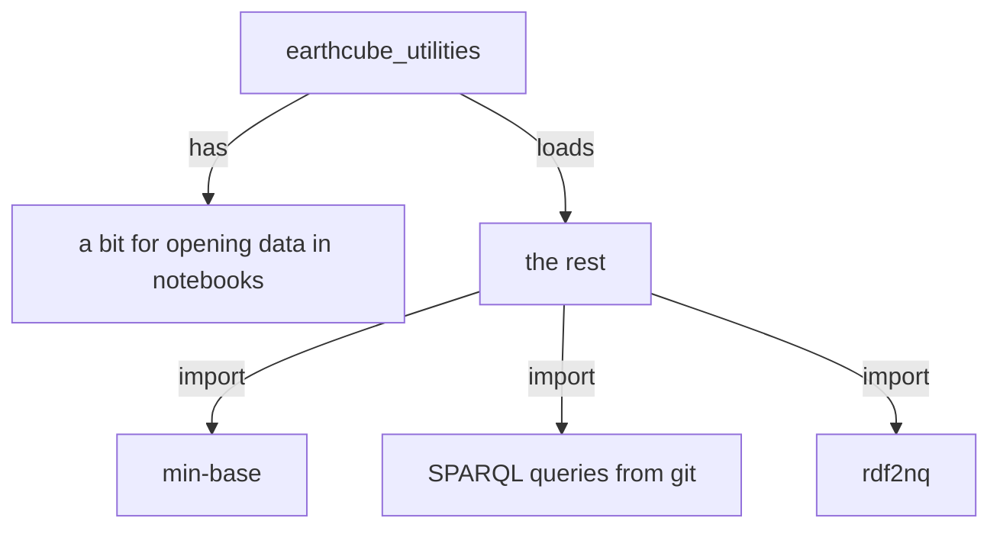

# earthcube_utliites

Originally used for notebooks only, but getting more reuse in the rest of the workflow
 `this has caused a natural breakdown of submodules, that can be used as needed`

(??? what does caused mean?)



_What does this graphic tell a potiential user about the **Functionality** of the  library_ 

## _**earthcube_utilities** breakdown_


the file itself can keep some of the notebook specific code or that can go into a notebook/data_download sub modules

_If it can be that is good, but this is about clean coding. So how does importing a single undocumented 
module help a user utilize it._

Functionality:
* mini-base
* query
* rdf to triples
* Additional Modules

### Minibase
<ins>__mb.py__ mini-base small util functions</ins> that sometimes end up getting copied into the other places they are needed now
 __some of this could be replaced by libs like: [pydash](https://github.com/dgilland/pydash)__


### Query
<ins>**query.py** </ins> is can do all the SPARQL queries the UI can do.

Query returns a pandas dataframe using the sparqldataframe library. A set of queries based
on the the [facetserch UI sparql queries](https://github.com/earthcube/facetsearch/tree/master/client/src/sparql_blaze)
and other queries utilized for data exploration and data validation are included.

LIST QUERIES: This is the detailed functionality

(I am going to suggest that a list of queries, and functionality, and some details be incorporated into an assets
list. The list should probably be a file in YAML or JSON format in the resources directory.)

|  short_name | file | detailed description |
|-------------| ---- | ------ | 
| summary     | ./resources/sparql/summary.txt | takes query term, `q`, and returns a summary of the matched resoruces |
| sbj2urn     | ./resources/sparql/sbj2urn.txt  | returns the urn of the graph  for a given graph `g`   |

_This is the proposed implementation stratedgy..._ 
it is setup to add one get_{qry_name}\_txt  function to get the txt of the query, usually from raw git 
then a function: {qry_name} that calls one fuction with {qry_name} as the arg, and maybe a variable
it will get the txt from the 1st function, and replace the var w/in the template txt, run the query and return a DF

(**above  reads  like a possible security hole** seems overly complex,--suggest that queries be embedded in resources. )
Could we do something simpler, like:

```
def QUERY(endpoint)
# validate that endpoint exists.
def listQueries() 
# return list of queries
def query(self, short_name=summary, options)
# where options would be an object containing passed parameters {"q":"steens"}
def queryFromURL(self, url="https://raw.githubusercontent.com/MBcode/ec/master/NoteBook/sparql-query.txt", options)
```

```python
q = QUERY("http:example.com")
dataframe = q.query("sub2urn",options={"g":"somegraph"} )
dataframe2 = q.queryFromURL( url="https://raw.githubusercontent.com/MBcode/ec/master/NoteBook/sparql-query.txt", options={"q":"steens"})

```
Also, suggest jinja2, or the [standard python3 templates](https://docs.python.org/3.4/library/string.html#template-strings) for replacing parameters in templates.

### RDF to triples
At present, gleaner generates triples, and nabu loads them into the graph as quads.
The summary code needs to know the expected `graph` so this module creates quads from gleaner/milled
Basically, <ins>**rdf2nq.py** takes one form of rdf triples, 
and adds the filename of the file as the last column in its nquads<ins> output
* if it is .ntriples, then you just add a column
* if it is another format like jsonld, then it runs jena's riot RDF I/O technology (RIOT) on it, right now

_Some related could probably be handled by [kglab](https://derwen.ai/docs/kgl/ex4_0/) now_

### Additional Modules
There is more that I'm working on the grouping [now](./docs/sm.md) 
to include some high level descriptions of possible groupings/(of)functionality

 and there is the original third sectioned off for the [old](https://github.com/earthcube/ec/blob/master/ect.py) testing, that parts of can integrated w/the new logging..


## Proposed use
### Earthcube Utilties:
https://test.pypi.org/project/earthcube-utilities/
(presently test.pypi)

python3 -m pip install --index-url https://test.pypi.org/simple/ earthcube-utilities