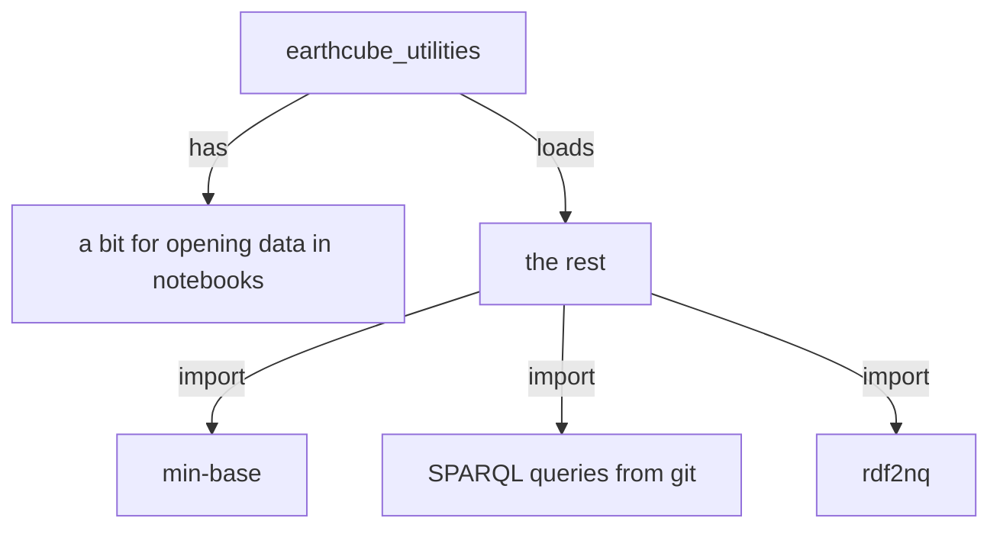

### earthcube_utliites

#### originally used for notebooks only, but getting more reuse in the rest of the workflow

##### this has caused a natural breakdown of submodules, that can be used as needed

