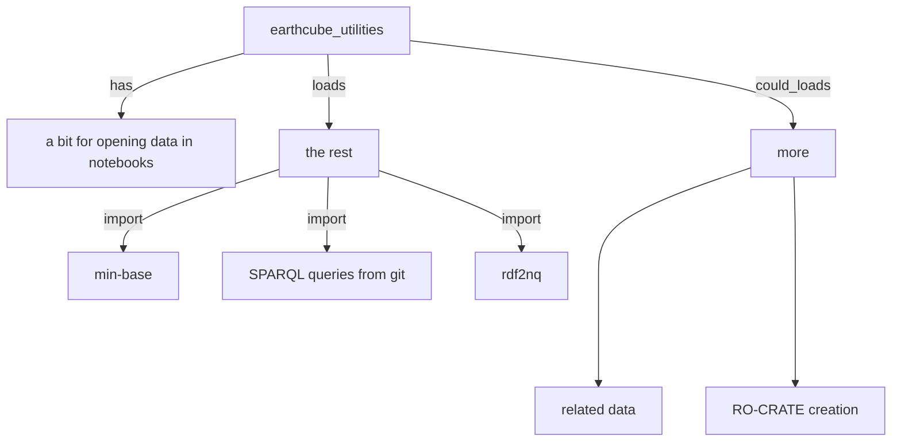

### earthcube_utliites

#### originally used for notebooks only, but getting more reuse in the rest of the workflow

##### this has caused a natural breakdown of Sub-Modules, that can be used as needed

### <ins>**earthcube_utilities** breakdown</ins>

#### the file itself can keep some of the notebook specific code or that can go into a notebook/data_download sub modules

#### <ins>__mb.py__ mini-base small util functions</ins> that sometimes end up getting copied into the other places they are needed now
##### some of this could be replaced by libs like: [pydash](https://github.com/dgilland/pydash)

#### <ins>**query.py** is can do all the SPARQL queries the UI can do<ins>
##### it is setup to add one get_{qry_name}\_txt  function to get the txt of the query, usually from raw git
##### then a function: {qry_name} that calls one fuction with {qry_name} as the arg, and maybe a variable
###### it will get the txt from the 1st function, and replace the var w/in the template txt, run the query and return a DF

#### <ins>**rdf2nq.py** takes one form of rdf triples, and adds the filename of the file as the last column in its nquads<ins> output
##### if it is .ntriples, then you just add a column
##### if it is another format like jsonld, then it runs jena's riot RDF I/O technology (RIOT) on it, right now
##### Some related could probably be handled by [kglab](https://derwen.ai/docs/kgl/ex4_0/) now

### There is more that I'm working on the grouping [now](https://mbobak.ncsa.illinois.edu/ec/utils/?C=M;O=D)
#### to include some high level descriptions of possible groupings/(of)functionality
#### and there is the original third sectioned off for the [old](https://github.com/earthcube/ec/blob/master/ect.py) testing, that parts of can integrated w/the new logging..

### Could be loading:
##### related-data using sklearn [here](https://github.com/MBcode/ec/blob/master/qry/rec.py)
##### RO-CRATE creation, that dv asked for
