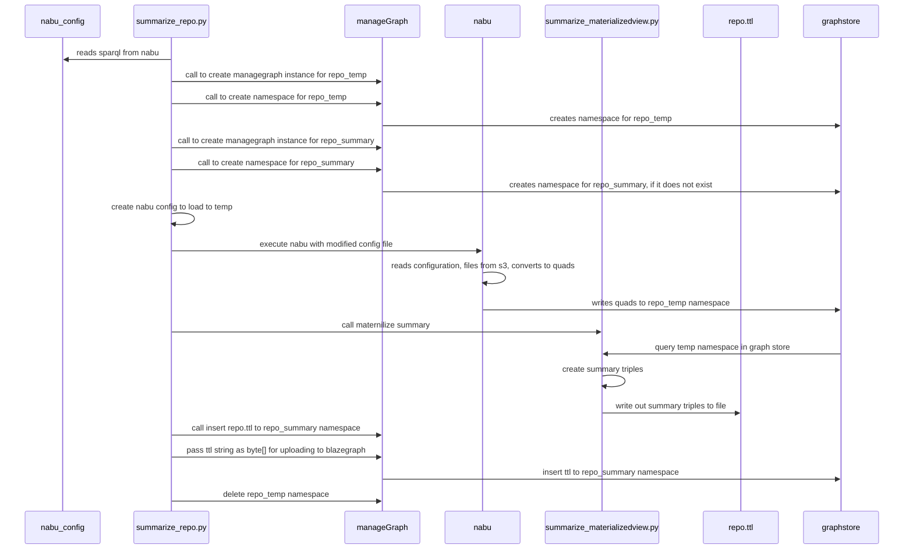

# Summarize

## Overview
Because of the lack of standardardization on how Science on Schema is implemented, there are performance issues
quering and retrieving information from the blazegraph graphstore. Because JSONLD fields can be strings/objects/arrays
asking the graphstore to guess the best optimization for retrieval is haphazard.
In order to work around this, we create a materilized view view. Materialization is common performance trick
which basically brings all values into a single object so that retreival of what would be normalized
information is flattened.  The JSONLD strings/objects/arrays single object to improve search and retrieval performance. 

**Summarize tools** create a 'materialized" view of a repositories JSONLD as triple to improve
performance a searches for geocodes. 

To do this, it reads the named graphs (aka quads) that nabu generates as part of its workflow, then 
converts them into flattend triples in  'summary' graph namespace.



## Dependencies
* Geocodes Stack
* glcon
* python > 3.3
* the nabu configuration file that was used to load the data to the graphstore

## INSTALL

* pull repository,
    * `git clone https://github.com/earthcube/earthcube_utilities.git`
* `cd earthcube_utilities/summarize`
* install python dependencies
    * `pip3 install requirements.txt`
* Run steps below

##  Approaches
* Summarize existing graph stores. AKA: data is loaded into a graph. The can and should be subsetted using  a repository name.
* Summarize as part of workflow, aka build summary when repo is loaded. 
  This is useful for onboarding a new repository
   it loaded from s3 to a grpah using `glcon nabu` into a temporary repository, 
  queries, then pushes results to a summary namespace
* Build summary for a 'release' graph (coded, but untested/undocumented)

### Summarize an existing graph stores. 
This can  summarize an entire graph store, or just process a msubset, eg, a recently update repo.
* The information is in an existing blazegraph instance 
    * ` glcon nabu prefix --cfgName {configdir} ` 
* There exists a  summary namespace in a blazegraph instance

```text
usage: summarize_from_graph_namespace.py [-h] [--repo REPO] --graphendpoint GRAPHENDPOINT [--graphsummary GRAPHSUMMARY] [--summary_namespace SUMMARY_NAMESPACE]

optional arguments:
  -h, --help            show this help message and exit
  --repo REPO           repo name used in the urn
  --graphendpoint GRAPHENDPOINT
                        graph endpoint with namespace
  --graphsummary GRAPHSUMMARY
                        upload triples to graphsummary
  --summary_namespace SUMMARY_NAMESPACE
                        summary_namespace defaults to {repo_summary}

```
#### run summarize_from_graph_namespace
1. if you have not, changed to the summarize directory: `cd  earthcube_utilities/summarize`
2. run

```shell
./src/summarize_from_graph_namespace.py --repo {repo} --graphendpoint {endppiont} --summary_namespace {earthcube_summary}

```
repo is optional. Without the  `--repo` the code will summarize all information

### Summarize a part of qualifying a repostiory for loading into geocodes
As part of the qualifying of a repository for loading we want to load the data into separate instances
This codebase will read a gleaner configuraiton, push the summoned information to a repository, and create a
summary repository

```text
usage: summarize_repo.py [-h] [--graphendpoint GRAPHENDPOINT] [--glcon GLCON] [--graphsummary GRAPHSUMMARY] [--keeptemp GRAPHTEMP]
                         [--summary_namespace SUMMARY_NAMESPACE]
                         repo nabufile

positional arguments:
  repo                  repository name
  nabufile              nabu configuration file

optional arguments:
  -h, --help            show this help message and exit
  --graphendpoint GRAPHENDPOINT
                        override nabu endpoint
  --glcon GLCON         override path to glcon
  --graphsummary GRAPHSUMMARY
                        upload triples to graphsummary
  --keeptemp GRAPHTEMP  do not delete the temp namespace. a namespace {repo}_temp will be created
  --summary_namespace SUMMARY_NAMESPACE
                        summary_namespace defaults to {repo}_temp_summary

```

#### run summarize_repo
```shell
./src/summarize_repo.py {repo} {path_to_nabu_config_file} --graphendpoint {endppiont} --summary_namespace {{repo}_temp_summary}

```
