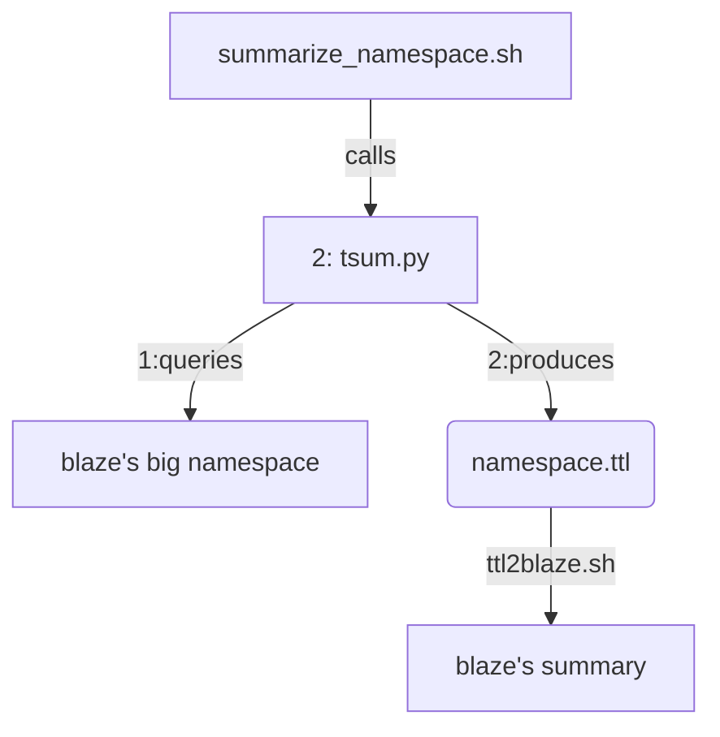

## what you call to run initial summarization

#### For the initial summarziation, we can pull from blaze and summarize all the repos in the namespace filled by the crawl

### after that we would go back to adding on a per repo basis, as see [here](call.md)

as soon as the [system](https://github.com/MBcode/ec/blob/master/system.md) is made more modular, the repo.nq can come from my [crawl](https://github.com/MBcode/ec/tree/master/crawl) as well
