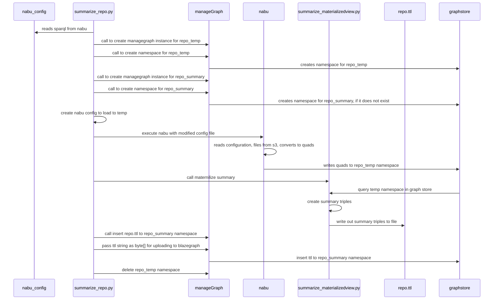

#  v2 summary


## v2


### Dependencies
* stack
  * s3
  * blazegraph
* glcon/nabu
* python

### Workflow
**curl and wget are not standard packages in the base docker images. Use python requests.**

#### summarize a python script to call the methods needed.
* parameters  for 
   * nabu_cfg. glcon generates a gleaner and a nabu file. where is this nabu file.
   * repo name
   * (override) graphendpoint
   * (override) path to glcon
   *  graphsummary if true, upload summary triples to summary_namespace
      * (opt) summary_namespace (default: {repo}summary)
   * (later) upload to s3
* **workflow**
   * see if nabu_cfg exists, get sparql.endpoint from file
   * create temp_namespace
   * run nabu to make quads into temp namespace
   * run summarize_materializedview.py to create summary triples
   * if uploadSummary, use python requests to upload summary



**details**


1. cli to read parameters
2. read sparql.endpoint from nabu file (unless overriden by graphendpoint )
```minio:
    address: oss.geocodes.ncsa.illinois.edu
    port: 443
    ssl: true
    accesskey: worldsbestaccesskey
    secretkey: worldsbestsecretkey
    bucket: gleaner
objects:
    bucket: gleaner
    domain: us-east-1
    prefix:
        - summoned/iris
        - org
    prefixoff: []
sparql:
    endpoint: https://graph.geocodes.ncsa.illinois.edu/blazegraph/namespace/iris_nabu/sparql
    authenticate: false
    username: ""
    password: ""
```
4. python request to create a temp_repo namespaces in a blazegraph (repo_temp, repo_summary)
5. Quads/Nabu step (future:  nabu can write out a file. It now can, but no binaries done yet )
    * modify nabu file with a correct sparql.endpoint (aka temp_repo)
    * run nabu for repository: `glcon nabu prefix --cfg {nabu_cfg} --prefix summonned/{repo}` 
* use methods in  summarize_materializedview.py
* ( write out to file, or whatever
*  upload to repo_summary with a python script. read file a binary, insert
* (  python request to delete temp namespace

#### summarize_materializedview.py to make graph using rdflib.
ideas on how to improve the summary generate to make less use of print, and more use of a 
library to generate triples/quad, etc

1. create an rdflib graph
```python
from rdflib import Graph

g = Graph()
```

2. read all graphs identifiers from temp_repo
   1. for each graph, g
       1. create rdf triples using rdflib, 

```python
from rdflib import URIRef, BNode, Literal
from rdflib import Namespace

n = Namespace("https://schema.org/")
tripleuri = URIRef(g)
title = Literal({title})  # passing a string
g.add((tripleuri, n.title, title))
## repeat for other summary triples
```
3. add tripe to graph
4. every (100/1000) save graph to file.
5. serialize
```python
g.serialize(format="nquads", destination="{repo}.ttl")
```
6. write to std.out, 